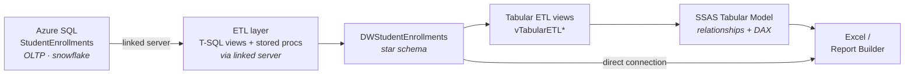
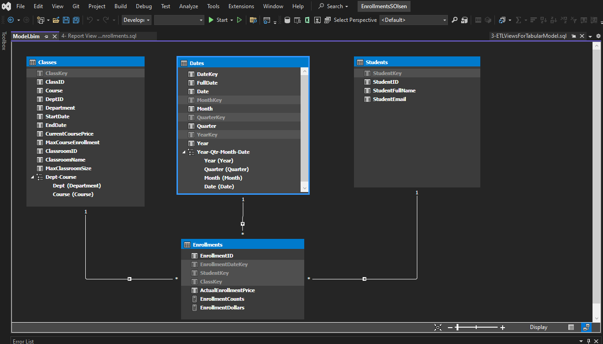

# Student Enrollments — End-to-End BI Solution

A complete Microsoft BI stack solution for a small private school: an **Azure SQL OLTP source**,
a **star-schema data warehouse**, a **fully logged T-SQL ETL pipeline**, an **SSAS Tabular
semantic model** with DAX measures, and **Excel / Report Builder** outputs — all built and
deployed from a single Visual Studio (SSDT) solution.

Built as the capstone for **UW BIDD 310 – Relational & Non-Relational Databases** (Fall 2025),
part of the University of Washington Postgraduate Certificate in Business Intelligence & Data
Integration.

**Stack:** SQL Server · Azure SQL · T-SQL · SSAS Tabular · Visual Studio (SSDT) · Report Builder · Excel

---

## Architecture

The solution moves data from a normalized transactional source to an analytics-ready semantic
model, with a full-refresh ETL layer in between and audit logging on every step.



---

## Repository contents

| Path | What it is |
| --- | --- |
| `sql/0-CreateTheStudentEnrollmentsDatabase.sql` | Builds the **source** OLTP database (`StudentEnrollments`) — normalized tables, FK constraints, sample data. |
| `sql/1-CreateTheDWStudentEnrollmentDatabase.sql` | Builds the **data warehouse** (`DWStudentEnrollments`) — star-schema tables, base abstraction views, and a metadata view. |
| `sql/2-PerformTheETLProcess.sql` | The **full ETL pipeline** — linked server, logging, drop/truncate/reload sequencing, dimension and fact loads. *(Credentials are placeholders — see [How to run](#how-to-run).)* |
| `sql/3-ETLViewsForTabularModel.sql` | **Tabular staging views** (`vTabularETL*`) that feed the SSAS model, with final date-key conversions. |
| `sql/4-ReportViewForDWStudentEnrollments.sql` | A denormalized **reporting view** (`vRptStudentEnrollments`) joining the fact to all dimensions for ad-hoc reporting. |
| `docs/StudentEnrollments_Admin_Manual.pdf` | Full admin manual — architecture, ERDs, metadata, and ETL object reference. |
| `docs/DWStudentEnrollmentsERD.pdf` | Star-schema ERD for the data warehouse. |
| `images/` | Tabular model screenshots (solution structure, model diagram, DAX measures). |

Scripts are numbered in execution order — run them `0 → 4`.

---

## Data model

**Source (`StudentEnrollments`)** is a normalized, snowflake-style OLTP schema optimized for
transactions, not reporting: `Students`, `Classes`, `Enrollments`, `Classrooms`, `Departments`.

**Warehouse (`DWStudentEnrollments`)** collapses that into a **star schema** — one fact table
surrounded by three dimensions — for simpler, faster reporting. `Departments` and `Classrooms`
are folded into `DimClasses`, and column names are made business-friendly.

| Table | Type | Grain | Key |
| --- | --- | --- | --- |
| `FactEnrollments` | Fact | One row per student enrollment in a class on a date | Composite natural key; FKs to all three dims |
| `DimClasses` | Dimension | One row per class | `ClassKey` (surrogate) |
| `DimStudents` | Dimension | One row per student | `StudentKey` (surrogate) |
| `DimDates` | Dimension | One row per calendar date | `DateKey` |

The only measure carried on the fact is `ActualEnrollmentPrice`.

---

## ETL pipeline

The ETL is implemented **entirely in SQL Server**, pulling from Azure through a linked server
(`MSOLEDBSQL` provider). It runs as a full refresh with a strict, logged sequence:

1. Create metadata / logging objects (`EtlLog`, `vEtlLog`, `pInsEtlLog`)
2. Drop fact-table foreign keys (`pETLDropFks`)
3. Truncate all warehouse tables (`pETLTruncateTables`)
4. Load `DimDates` → `DimStudents` → `DimClasses` → `FactEnrollments`
5. Re-create foreign keys (`pETLReplaceFks`)

**Object inventory**

| Object | Type | Purpose |
| --- | --- | --- |
| `EtlLog` / `vEtlLog` / `pInsEtlLog` | Table / View / Proc | Audit log of every ETL event, with row counts and captured errors |
| `pETLDropFks` / `pETLReplaceFks` | Proc | Drop and re-create fact FK constraints around the reload |
| `pETLTruncateTables` | Proc | Clear all DW tables for a clean full refresh |
| `pEtlDimDates` | Proc | Generate the full date dimension (see below) |
| `vETLDimStudents` / `pETLDimStudents` | View / Proc | Transform and load students |
| `vETLDimClasses` / `pETLDimClasses` | View / Proc | Combine class + classroom + department, then load |
| `vETLFactEnrollments` / `pETLFactEnrollments` | View / Proc | Surrogate-key lookups, then load the fact |

**Design decisions worth calling out:**

- **Audit logging on every step.** Each proc wraps its work in `TRY/CATCH` and writes an
  `EtlLog` entry — start, success with row count, or the captured SQL error — so a run is fully
  traceable after the fact.
- **Unknown / corrupt members in `DimDates`.** The date dimension is generated in-database with
  a `WHILE` loop (2019–2029) and includes dedicated `-1` (Unknown) and `-2` (Corrupt) rows, so
  the fact load never fails on a missing or bad date.
- **Defensive dimension loads.** `DimClasses` uses a `FULL JOIN` across the three source tables
  with `ISNULL` defaults (`Undecided`, `-1` surrogates, sentinel dates) so incomplete source
  rows still land cleanly.
- **Layered views as an abstraction boundary.** Base views (`vDim*`), ETL staging views
  (`vETL*`), tabular views (`vTabularETL*`), and a reporting view (`vRptStudentEnrollments`)
  each serve a distinct consumer, keeping physical tables decoupled from downstream tools.

---

## Semantic model & measures

The SSAS Tabular model (`Model.bim`) loads from the `vTabularETL*` views rather than the raw
tables, giving a final transformation seam before the model. It defines the four tables, the
relationships between them, calculated columns, and DAX measures.



Measures on the `Enrollments` table include:

- **`EnrollmentCounts`** — `DISTINCTCOUNT([EnrollmentID])`
- **`EnrollmentDollars`** — a sum of `ActualEnrollmentPrice`

---

## Reporting

Two output paths validate the model end to end:

- **Tabular → Excel** — confirms the DAX measures resolve correctly for end users.
- **Data Warehouse → Excel** — confirms a direct warehouse connection also works.

A `Report Builder` (`.rdl`) report and Excel workbooks sit on top of the reporting view.

---

## How to run

> **Requirements:** SQL Server (or Azure SQL) with SSDT/Visual Studio, plus SSAS Tabular for the model.

1. Run `sql/0-...` to build the source OLTP database (or point at your Azure `StudentEnrollments`).
2. Run `sql/1-...` to build the warehouse schema and views.
3. In `sql/2-...`, replace the linked-server placeholders with your own connection details:
   ```sql
   @datasrc     = N'<your-server>.database.windows.net'
   @rmtuser     = N'<your-azure-login>'
   @rmtpassword = N'<your-azure-password>'
   ```
   Then run it to create the ETL objects and execute a full load.
4. Run `sql/3-...` and `sql/4-...` to create the tabular and reporting views.
5. Deploy the SSAS Tabular project and connect Excel / Report Builder.

Do **not** commit real credentials — keep them local or move them to a secure connection method.

---

## Documentation

The complete [Admin Manual](docs/StudentEnrollments_Admin_Manual.pdf) documents the full
architecture, both ERDs, the metadata worksheet, and every ETL object in detail.

---

*Built by Samuel Olsen — [LinkedIn](https://www.linkedin.com/in/samuel-olsen-734960139) · [GitHub](https://github.com/olsensam2)*
